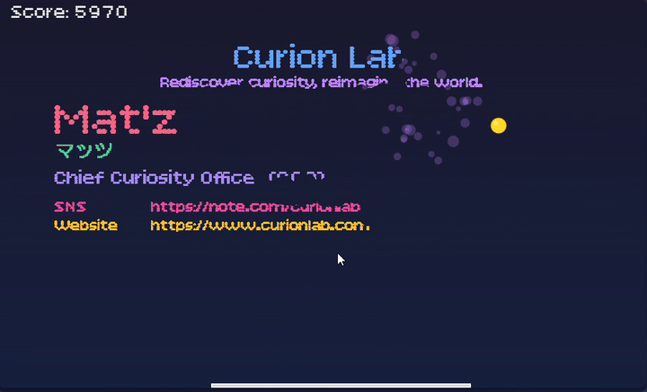

# 🎮 Business Card Breakout

[](https://breakout.curionlab.com/)
[](https://www.npmjs.com/package/business-card-breakout)
[](https://opensource.org/licenses/MIT)

Transform your business card into an interactive breakout game! A fun and creative way to showcase your contact information on your website or portfolio.

## [🚀 Try Live Demo →](https://breakout.curionlab.com/)



> 💡 **Tip**: Click the demo link above to play with different layouts and see the game in action!

## ✨ Features

- 🎯 **Interactive Breakout Game** - Classic arcade gameplay with your business card
- 🎨 **Three Layout Styles** - Professional, Standard, and Minimal
- 🌐 **Multi-language Support** - Works with Japanese, English, and other languages
- 📱 **Responsive Design** - Adapts to any screen size
- ⚡ **Lightweight** - Only ~24KB (minified UMD)
- 🔧 **Highly Customizable** - Adjust game physics, colors, and behavior
- 🚀 **Easy Integration** - One line of code to get started

## 🚀 Quick Start

### Via CDN (Easiest)

```html
<!DOCTYPE html>
<html>
<head>
  <style>
    #game-container {
      width: 600px;  /* Required: specify container width */
    }
  </style>
</head>
<body>
  <div id="game-container"></div>

  <script src="https://cdn.jsdelivr.net/npm/business-card-breakout@latest/dist/index.umd.js"></script>
  <script>
    const engine = BusinessCardBreakout.initializeGame(
      'game-container',
      {
        name: 'Your Name',
        title: 'Your Title',
        company: 'Your Company',
        email: 'your@email.com'
      },
      BusinessCardBreakout.DEFAULT_GAME_CONFIG,
      'standard',
      false
    );
    
    engine.start();
  </script>
</body>
</html>
```

### Via npm

```bash
npm install business-card-breakout
```

```javascript
import { initializeGame, DEFAULT_GAME_CONFIG } from 'business-card-breakout';

const engine = initializeGame(
  'game-container',
  {
    name: 'Your Name',
    title: 'Your Title',
    company: 'Your Company',
    email: 'your@email.com'
  },
  DEFAULT_GAME_CONFIG,
  'standard',
  false
);

engine.start();
```


## ⚠️ Important: Container Size

**The container element must have a width specified.** The height is automatically calculated based on the business card aspect ratio (91:55).

```html
<!-- ✅ Good: CSS style -->
<style>
  #game { width: 600px; }
</style>
<div id="game"></div>

<!-- ✅ Good: Inline style -->
<div id="game" style="width: 600px;"></div>

<!-- ✅ Good: Responsive with max-width -->
<style>
  #game {
    width: 100%;
    max-width: 600px;
  }
</style>
<div id="game"></div>

<!-- ❌ Bad: No width specified (canvas will be too large) -->
<div id="game"></div>
```


## 📖 Documentation

### Business Card Configuration

```typescript
{
  name: string;           // Required: Your name
  nameEn?: string;        // Optional: English name (for non-English names)
  title: string;          // Required: Your job title
  tagline?: string;       // Optional: Personal tagline or catchphrase
  company: string;        // Required: Company name
  email: string;          // Required: Email address
  phone?: string;         // Optional: Phone number
  sns?: string;           // Optional: SNS handle or URL
  website?: string;       // Optional: Website URL
}
```

### Layout Options

- `'professional'` - Full layout with all fields including SNS
- `'standard'` - Traditional business card layout
- `'minimal'` - Clean, essential information only

### Game Configuration

```typescript
{
  // --- Game Mechanics (Relative Values) ---
  paddleWidthRatio: number; // Paddle width relative to screen width (default: 0.4 = 40%)
  paddleSpeedRatio: number; // Paddle speed relative to screen width (default: 0.015)
  ballSpeedRatio: number; // Ball speed relative to screen width (default: 0.009)
  ballRadiusRatio: number; // Ball size relative to screen width (default: 0.012)

  // --- Physics & Timing ---
  blockRecoveryTime: number; // Time until blocks reappear in ms (default: 10000)
  effectDuration: number; // Duration of particle effects in ms (default: 5000)
  gravity: number; // Gravity applied to the ball (default: 0)
  friction: number; // Friction applied to the paddle (default: 1.0)

  // --- Fixed Values (Optional overrides) ---
  paddleHeight: number; // Fixed paddle height in pixels (default: 4)
  // Note: paddleWidth, paddleSpeed, ballSpeed, and ballRadius are automatically calculated
  // based on the ratios above, but can be manually overridden if needed.
  destructionRadius: number;   // Destruction area radius (default: 30)
}
```

## 🎨 Examples

**[👉 See more examples in live demo](https://breakout.curionlab.com/)**

### Japanese Business Card (Full)

```javascript
const engine = initializeGame('game', {
  name: '山田 太郎',
  nameEn: 'Taro Yamada',
  title: 'シニアソフトウェアエンジニア',
  tagline: '未来を創るコードを書く',
  company: 'テックコーポレーション',
  email: 'taro.yamada@example.com',
  phone: '+81-90-1234-5678',
  sns: '@taroy_dev',
  website: 'yamada-tech.example'
}, DEFAULT_GAME_CONFIG, 'professional', false);

engine.start();
```

### English Business Card (Minimal)

```javascript
const engine = initializeGame('game', {
  name: 'Jane Smith',
  title: 'Product Manager',
  company: 'Innovation Labs',
  email: 'jane@example.com'
}, DEFAULT_GAME_CONFIG, 'minimal', false);

engine.start();
```

## 🛠️ API Reference

### `initializeGame(containerId, businessCard, gameConfig, layout, autoStart)`

- **containerId** `string` - DOM element ID for the game container
- **businessCard** `Partial<BusinessCardInfo>` - Your business card information
- **gameConfig** `Partial<GameConfig>` - Game configuration (use `DEFAULT_GAME_CONFIG` for defaults)
- **layout** `'professional' | 'standard' | 'minimal'` - Card layout style
- **autoStart** `boolean` - Whether to start automatically (recommended: `false`)

### Game Engine Methods

```javascript
engine.start();     // Start the game
engine.stop();      // Stop the game
engine.pause();     // Pause the game
engine.resume();    // Resume the game
```

## 🎨 Recommended: Custom Font

For a pixel-style retro look, add this font before the game script:
```html
<link href="https://fonts.googleapis.com/css2?family=Bitcount+Prop+Single:wght@400&family=DotGothic16&family=Press+Start+2P&family=ZCOOL+QingKe+HuangYou&family=Noto+Sans+Thai&family=Noto+Sans+Arabic&family=Noto+Sans+KR&display=swap" rel="stylesheet">
```

### Complete example:  
```html
<!DOCTYPE html>
<html>
<head>
  <link href="https://fonts.googleapis.com/css2?family=Bitcount+Prop+Single:wght@400&family=DotGothic16&family=Press+Start+2P&family=ZCOOL+QingKe+HuangYou&family=Noto+Sans+Thai&family=Noto+Sans+Arabic&family=Noto+Sans+KR&display=swap" rel="stylesheet">
  <style>
    #game { width: 600px; }
  </style>
</head>
<body>
  <div id="game"></div>
  <script src="https://cdn.jsdelivr.net/npm/business-card-breakout@latest/dist/index.umd.js"></script>
  <script>/* ... */</script>
</body>
</html>
```

## 🌐 Browser Support

- Chrome/Edge (latest)
- Firefox (latest)
- Safari (latest)
- Mobile browsers (iOS Safari, Chrome Mobile)

## 📦 Package Size

- **UMD (CDN)**: ~24.9 KB
- **ES Module**: ~51.6 KB
- **TypeScript Types**: Included

## 🎯 Use Cases

Perfect for:
- 💼 Portfolio websites
- 🎪 Networking events
- 🎨 Creative presentations
- 📧 Email signatures (with link)
- 🌐 Personal branding

## 🤝 Contributing

Contributions are welcome! Please feel free to submit a Pull Request.

## 🔗 Links

- **[🎮 Live Demo](https://breakout.curionlab.com/)** ⭐
- [GitHub Repository](https://github.com/curionlab/business-card-breakout)
- [npm Package](https://www.npmjs.com/package/business-card-breakout)
- [CDN (jsDelivr)](https://cdn.jsdelivr.net/npm/business-card-breakout@latest/)
- [Examples](https://github.com/curionlab/business-card-breakout/tree/main/examples)

## 📄 License

MIT © [Curion Lab](https://github.com/curionlab)

---

Made with ❤️ by [Curion Lab](https://www.curionlab.com/)
